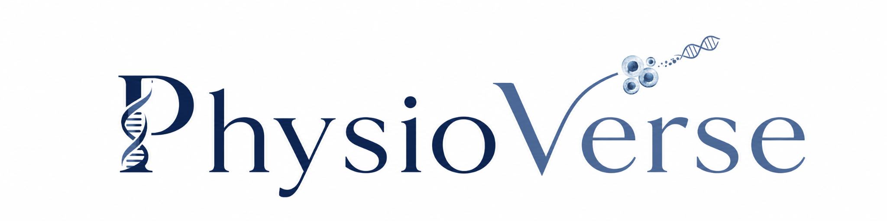

  

  <h3>Open-source ecosystem for regenerative medicine innovation</h3>

  

    <strong>PhysioVerse-OSE</strong> brings together data resources, tools, standards exchange,
    learning pathways, and community workflows for organoids, body-on-chip systems,
    tissue chips, and related microphysiological systems.
  

  

    <a href="https://main.d1lur6xxswxv3s.amplifyapp.com/"><strong>Visit the platform</strong></a>
    ·
    <a href="https://main.d1lur6xxswxv3s.amplifyapp.com/on-ramp"><strong>Start on the OnRamp</strong></a>
    ·
    <a href="https://main.d1lur6xxswxv3s.amplifyapp.com/data-library"><strong>Explore the Data Library</strong></a>
    ·
    <a href="https://main.d1lur6xxswxv3s.amplifyapp.com/submit-data"><strong>Contribute</strong></a>
  

  

    
    
    
  

---

## What PhysioVerse is building

PhysioVerse is designed to reduce fragmentation in advanced in vitro and microphysiological system research by helping the community describe, compare, validate, discover, and reuse data and workflows across laboratories.

<table>
  <tr>
    <td width="33%" valign="top">
      <h3>Data compatibility</h3>
      
Shared metadata, model descriptors, assay context, file relationships, and review workflows that make advanced model system data easier to compare and reuse.

    </td>
    <td width="33%" valign="top">
      <h3>Open tools</h3>
      
Templates, validation resources, workflow components, and open-source software that help teams implement reproducible and interoperable practices.

    </td>
    <td width="33%" valign="top">
      <h3>Community adoption</h3>
      
Learning pathways, standards exchange, contributor workflows, and translational resources for users, developers, curators, institutions, and industry partners.

    </td>
  </tr>
</table>

## Why this matters

Advanced in vitro systems, including organoids, body-on-chip systems, tissue chips, and related microphysiological systems, are becoming important for drug discovery, toxicity assessment, disease modeling, personalized medicine, and reducing reliance on animal models.

Their impact depends on whether data from different laboratories can be interpreted together. PhysioVerse supports that goal by connecting data, metadata, tools, workflows, standards, learning activities, and community review practices in one open ecosystem.

## Start here

<table>
  <tr>
    <td width="50%" valign="top">
      <h3>New to PhysioVerse?</h3>
      
Use the OnRamp to choose the path that matches what you want to do.

      
<a href="https://main.d1lur6xxswxv3s.amplifyapp.com/on-ramp">Open the OnRamp →</a>

    </td>
    <td width="50%" valign="top">
      <h3>Looking for data?</h3>
      
Explore discoverable dataset records, metadata, repository links, and access pathways.

      
<a href="https://main.d1lur6xxswxv3s.amplifyapp.com/data-library">Explore the Data Library →</a>

    </td>
  </tr>
  <tr>
    <td width="50%" valign="top">
      <h3>Want to contribute?</h3>
      
Submit data, metadata, tools, documentation, repository links, workflows, or training resources.

      
<a href="https://main.d1lur6xxswxv3s.amplifyapp.com/submit-data">Contribute →</a>

    </td>
    <td width="50%" valign="top">
      <h3>Building tools?</h3>
      
Find open-source resources, sandbox activities, and developer-oriented pathways.

      
<a href="https://main.d1lur6xxswxv3s.amplifyapp.com/tools">Explore Tools →</a>

    </td>
  </tr>
</table>

## Ecosystem areas

| Area | Purpose |
|---|---|
| **Data Library** | Discover dataset records, metadata, repositories, and access pathways. |
| **Standards Exchange** | Align descriptors, metadata practices, benchmarking needs, and interoperability discussions. |
| **Tools** | Share templates, validation resources, examples, workflow components, and open-source software. |
| **Learning Network** | Support onboarding, training, documentation, and community learning activities. |
| **Community** | Bring together contributors, users, developers, curators, institutions, industry, and training partners. |
| **News and Events** | Track platform updates, workshops, standards activities, and opportunities to participate. |

## Featured repositories

- **[PhysioVerse-ML](https://github.com/PhysioVerse-OSE/PhysioVerse-ML)** — machine learning and data-science resources for the PhysioVerse ecosystem.
- **[.github](https://github.com/PhysioVerse-OSE/.github)** — organization profile and shared GitHub community files.

More repositories can be added here as the ecosystem grows.

## Community principles

PhysioVerse is intended to support open, responsible, and interoperable work across advanced model systems. The ecosystem emphasizes:

- reproducible and reusable data practices,
- transparent metadata and file relationships,
- community-informed standards exchange,
- open-source contribution pathways,
- human-relevant model systems and translational readiness,
- respectful collaboration across academic, nonprofit, government, and industry partners.

## Participate

PhysioVerse welcomes users, data contributors, tool developers, curators, educators, standards contributors, institutional partners, industry collaborators, and translational stakeholders.

  <a href="https://main.d1lur6xxswxv3s.amplifyapp.com/on-ramp"><strong>Start on the OnRamp</strong></a>
  ·
  <a href="https://main.d1lur6xxswxv3s.amplifyapp.com/community"><strong>Join the community</strong></a>
  ·
  <a href="https://main.d1lur6xxswxv3s.amplifyapp.com/contact"><strong>Contact us</strong></a>

